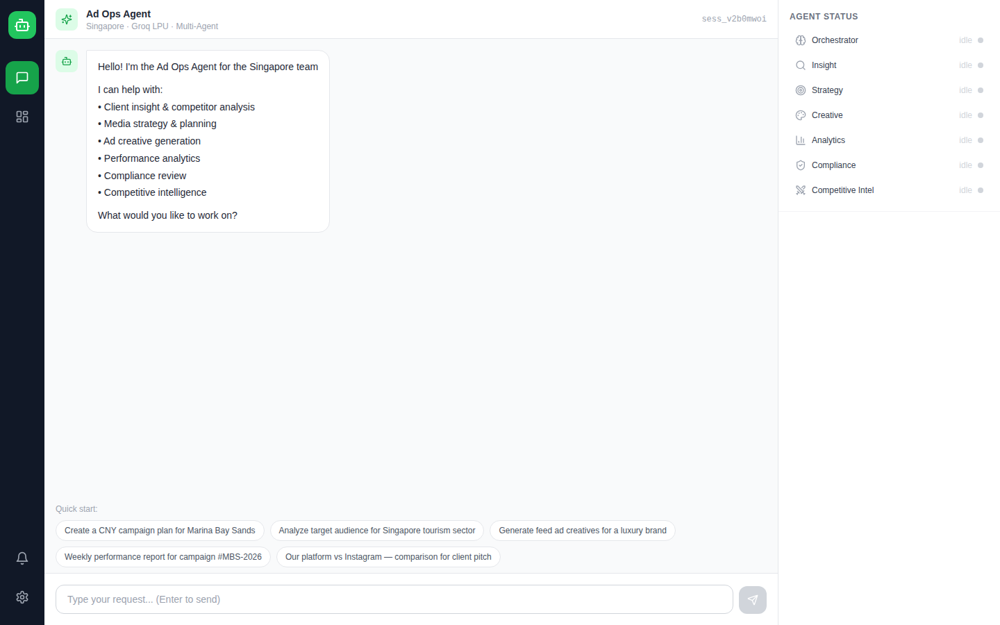

# Ad Ops Multi-Agent System

[](https://github.com/herui03/ad-ops-multi-agent/actions/workflows/tests.yml)

A multi-agent assistant for a digital advertising sales & operations team, built with LangGraph, FastAPI and React. An account manager types a request in plain English ("plan a CNY campaign for a Marina Bay hotel targeting Chinese tourists"); an orchestrator agent breaks it into sub-tasks, dispatches six specialist agents in dependency order, streams their status to the UI over WebSocket, pauses for human approval on budget and compliance decisions, and returns one client-ready brief.

The scenario is a cross-border social advertising platform whose Singapore team sells to Singapore brands that want to reach Chinese-speaking visitors and residents. Platform names, clients and campaign numbers are illustrative; the system runs in mock mode against sample data out of the box.



## What it does

| Agent | Responsibility | Model |
|---|---|---|
| **Orchestrator** | Classifies the request, writes an execution plan (which agents, in which order, with which dependencies), synthesises the final answer | Llama 3.3 70B |
| **Insight** | Client and audience profiling, competitor landscape, industry benchmarks | Llama 3.3 70B |
| **Strategy** | Media plan: placements, budget split, flight schedule, targeting, performance forecast | Llama 3.3 70B |
| **Creative** | Ad copy per placement (with A/B versions), visual briefs, video scripts | Llama 3.3 70B |
| **Analytics** | Campaign reporting, anomaly detection against benchmarks, optimisation suggestions | Llama 3.3 70B |
| **Compliance** | Reviews copy against platform policy and regulations retrieved from a RAG store; cites the source text for each issue | Llama 3.1 8B (fast) |
| **Competitive Intelligence** | Platform-vs-platform comparison, objection handling, pitch talking points | Llama 3.3 70B |

A few design decisions worth pointing out:

**Routing before planning.** Simple knowledge questions ("what is CPM?") are answered directly by the orchestrator without spinning up any agent. Only requests that produce deliverables go through the plan → execute → review → synthesise graph. For the most common queries this avoids five or six model calls and answers in one.

**Human-in-the-loop on the decisions that matter.** The graph has a dedicated review node. Any plan with a budget above a threshold, or any creative that fails compliance, is written to shared memory as a pending approval and pushed to the UI; the account manager approves or rejects with feedback before anything is finalised. An automation tool for ad spend that never asks is not one a sales team would trust.

**Grounded compliance.** The compliance agent doesn't rely on the model's memory of advertising rules. It retrieves the relevant passages from a small regulation corpus (platform policies, ASA/FTC-style advertising rules, client brand guidelines) with a TF-IDF retriever and is instructed to quote them. TF-IDF was a deliberate choice over an embedding service for a corpus of ~40 chunks: no external API, no vector database, fully reproducible.

**Dependency-ordered execution.** The orchestrator's plan carries `depends_on` links; steps are grouped into phases and run in order, so Strategy sees Insight's output in its context, Creative sees the media plan, and Compliance sees the creatives. Every agent's status (running / completed / failed) is streamed to the UI as it happens.

## Architecture

```
React UI (chat · dashboard · approval queue · live agent status)
        │  REST + WebSocket
   FastAPI backend
        │
   Orchestrator (LangGraph state machine)
   plan ──► execute agents (phased) ──► human review ──► synthesise
        │            │                                  │
        │   ┌────────┼──────────┬──────────┬────────────┼────────┐
        │   ▼        ▼          ▼          ▼            ▼        ▼
        │ Insight  Strategy  Creative  Analytics   Compliance    CI
        │                                              │
        │                                        TF-IDF RAG over
        │                                        rag_documents/
        ▼
   Shared memory (Redis, or in-process fallback): sessions, agent outputs, approvals
   Ad platform API client (mock mode with sample campaigns and benchmarks)
```

## Stack

Python 3.12 · FastAPI · LangGraph + LangChain · Groq (Llama 3.3 70B / 3.1 8B) · Redis (optional) · React 18 + Vite + Tailwind · pytest

## Running it

You need a free Groq API key from [console.groq.com](https://console.groq.com).

```bash
# backend
python -m venv venv && source venv/bin/activate
pip install -r requirements.txt
cp .env.example .env            # add GROQ_API_KEY
uvicorn backend.main:app --reload --port 8000

# frontend (second terminal)
cd frontend && npm install && npm run dev
```

Open http://localhost:5173. API docs are at http://localhost:8000/docs. `./start.sh` does both steps, and `docker compose up` runs backend, frontend and Redis together.

## Tests

```bash
pytest                      # unit tests, no API key needed
pytest tests/live -q        # live tests against Groq: routing, RAG grounding, edge cases
python scripts/demo_routing.py   # prints how the orchestrator routes sample requests
```

## Project layout

```
backend/
  agents/        orchestrator.py (LangGraph graph) + one file per specialist agent
  prompts/       system prompts and JSON output contracts for each agent
  tools/         ad platform API client (mock mode) and analytics helpers
  memory/        shared memory with Redis / in-process fallback
  rag.py         TF-IDF retriever over rag_documents/
  main.py        FastAPI app: chat, approvals, sessions, dashboard, WebSocket
frontend/src/    React UI: ChatPanel, AgentStatus, HumanApproval, Dashboard, CampaignView
rag_documents/   regulation corpus used by the compliance agent
tests/           unit tests; tests/live/ for LLM-backed tests
```

## Limitations and what I'd do next

The ad platform client is a mock; wiring a real ads API means replacing `backend/tools/ad_api.py` and adding auth. Agent outputs are validated as JSON but not against per-agent schemas yet; Pydantic models for each output would make the synthesis step more robust. The regulation corpus is small and hand-written; a real deployment would ingest the platform's actual policy documents and switch to embedding-based retrieval once the corpus outgrows TF-IDF. Steps within a phase still run one after another; independent agents (e.g. Strategy and CI) could run concurrently with `asyncio.gather`. There is no evaluation harness for output quality; the next step would be a small set of golden requests with rubric-based scoring.

## Background

Built for the BC3415 course project at NTU.

---

**Herui Dou** · MSc Business Analytics, NTU · [LinkedIn](https://www.linkedin.com/in/heruidou)
