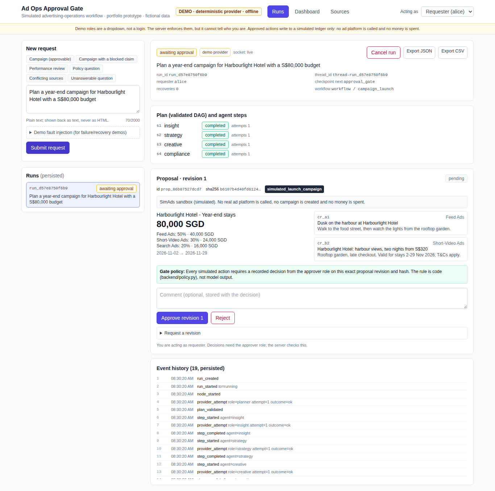

# Ad Ops Approval Gate: a reliability-first multi-agent prototype

[](https://github.com/herui03/ad-ops-multi-agent/actions/workflows/tests.yml)

A request such as *"plan a year-end campaign for Harbourlight Hotel with a S$80,000 budget"* goes to a LangGraph workflow. The workflow validates a plan, runs specialist agents step by step, and assembles a proposal. It then **stops at a durable human approval gate**. Only an approver's decision on that exact proposal revision and hash lets a *simulated* action through. The gate survives server restarts, duplicate clicks, stale revisions, provider failures and crashes near the action.

> **What this is:** a portfolio prototype built on a **simulated** advertising-operations use case.
> **What it is not:** a deployment for any real client or employer, a real ad-platform integration, or anything that spends money.
>
> The platform is the fictional **"SimAds sandbox"**. Clients (Harbourlight Hotel, NovaByte) are fictional. Policy documents are fictional or unverified summaries. No affiliation with any advertising platform or company is implied.
>
> **Credits:** Herui directed the project; Claude (AI coding assistant) implemented and tested it; Codex independently reviewed the baseline source. See [docs/DEFECT_LOG.md](docs/DEFECT_LOG.md).



## The problem it models

An ad-ops team turns a client brief into a media plan, ad copy and a policy check, and a manager signs off before money moves. Letting AI agents draft that package is easy. The hard part is making the sign-off **real**:

- nothing executes before approval;
- the approval covers exactly what was reviewed;
- a restart or double click cannot skip the gate or repeat the action;
- failures show up as failures, not as confident output.

This repository focuses on that part. Agent count is not the point.

## Quick start (offline, no key)

```bash
./scripts/start.sh            # creates .venv, installs, builds the UI once, serves http://127.0.0.1:8000
```

The default provider is **deterministic demo rules**, not a language model. It is labelled in the UI and API. No API key or network is needed after install. Mac and manual steps, the optional live provider, recovery and reset are in [docs/RUNBOOK.md](docs/RUNBOOK.md). There is also a terminal-only walkthrough: `python scripts/demo_cli.py`.

Until the PR is merged, use branch `claude/wonderful-cerf-efuysu`.

## How it works

```
React UI ── REST + read-only WebSocket ──► FastAPI ──► WorkflowRunner
                                                        ├─ LangGraph graph + SqliteSaver (thread_id per run)
                                                        ├─ SQLite store: runs, events, steps, proposals,
                                                        │   decisions, idempotency keys, simulated ledger
                                                        ├─ provider: demo (default) | Groq (opt-in)
                                                        └─ policy · grounding · simulator
plan ─► step ⟲ ─► build_proposal ─► approval_gate (interrupt) ─► execute_action ─► finalize
                         ▲                   ├─ reject ─► rejected
                         └──── revise ───────┤─ cancel ─► cancelled
```

Details, state diagrams, the transaction boundary and the design rationale are in [docs/ARCHITECTURE.md](docs/ARCHITECTURE.md).

| Guarantee | Mechanism | Proof |
|---|---|---|
| Action count stays 0 until approval | `interrupt()` at the gate. The simulator re-checks for an approve decision on the exact id, revision and hash, inside the same transaction as the ledger insert | `test_ac1_*`, `test_simulator_refuses_without_recorded_approval` |
| Pending survives a restart; the same run resumes | SQLite checkpointer with a stable `thread_id`; startup reconciliation | `test_ac2_*`; E2E kills the real server |
| One click wins; duplicates replay | One `BEGIN IMMEDIATE` transaction for all checks plus the status change; idempotency keys with a request hash | `test_ac4_*` (8 concurrent threads) |
| An accepted cancel always wins; a committed action is never hidden | `Store.finish` / `settle_gate` honour an accepted cancel atomically; cancel refuses with 409 once an action is committed; one atomic recovery claim | `test_r5_01_*`, `test_r5_02_*` (barrier-forced races) |
| Stale, forged or cross-run decisions fail | Current-revision, sha256 and run-ownership checks | `test_ac5_*`, `test_ac6_*` |
| A crash near the action does not duplicate it | Ledger row keyed `run:proposal:revision`; replay detection on Recover | `test_ac10_*`; E2E process exit after commit |
| Failures are bounded and honest | Per-call timeout, 2 attempts, strict schemas, `failed` status with a code; dependents never run | `test_ac8_*`, `test_invalid_plan_dag_*` |
| Model or source text cannot open the gate | The gate is code policy by workflow type; injected sources are excluded; citations must resolve | `test_ac12_*` |

## The six specialist agents

Each agent is a spec: a system prompt (live mode), a strict Pydantic output contract, and the upstream outputs it may read. Demo mode uses deterministic generators with the same output shapes.

| Agent | Produces | Validation beyond the schema |
|---|---|---|
| insight | client/audience profile, mock benchmarks | — |
| strategy | budget, schedule, placement split | percentages must sum to 100; the end date cannot precede the start |
| creative | ad copy per placement | unique creative ids |
| compliance | findings with a severity and a citation | every citation must resolve to a retrieved, non-flagged corpus chunk; a deterministic rule engine also runs as a backstop |
| analytics | anomalies against mock benchmarks, recommended budget shift | — |
| ci | illustrative channel comparison, talking points | — (the prompt forbids unsourced figures; this is not validated) |

Gated workflows: **campaign_launch** (simulated launch) and **performance_review** (simulated budget shift). **pitch_support** produces a deliverable only, so it has nothing to approve.

## Grounding (RAG): what it actually is

The corpus is 7 small documents, 37 section chunks, each with a stable id and a sha256. Retrieval is TF-IDF with cosine similarity. Answers are **extractive only**: verbatim sentences with citations that resolve to document, version, section and hash.

- It **abstains** when evidence is weak.
- It **reports a conflict** when two sources tagged with the same topic disagree.
- It **excludes** chunks containing instruction-like text.

The quoted sentences themselves must support the question, otherwise it abstains and lists *candidate evidence* labelled "not an answer". Conflicts are checked across the whole corpus.

On round 1 held-out cases it scored **19/23** (frozen). After review round 5 added these guards, a **new** held-out set written after freezing the answerer scored **21/24**. One remaining answer there is unsafe: it confidently answered a question it should have declined. See [docs/EVALUATION.md](docs/EVALUATION.md). A citation shows where a sentence came from; it is not legal approval or current law.

## Verified results

| What | Command | Result |
|---|---|---|
| Backend tests | `pytest -q -rs` | 96 passed, 1 skipped: the live-provider test is **NOT RUN** without `GROQ_API_KEY` |
| Browser E2E | `node e2e/run_e2e.mjs` | 16/16 checks: approval, role denial, rejection, revision, process kill while pending, crash after commit then cancel refused then Recover, provider failure then Recover, answers and candidate evidence, unsafe text, dashboard, mobile at 390 px |
| Grounding eval | `python scripts/run_eval.py [--cases …]` | round 1: 19/23 held-out (frozen); round 5: 21/24 on new held-out cases; round-1 set reused as regression: 22/23 |
| Baseline defects | `scripts/repro_baseline_defects.py` | 13/13 reproduced on the original code, each mapped to a fixing test |
| Review round 5 races | `pytest tests/test_review_r5.py` | old code `c149c38`: 8 failed / 2 passed; fixed: 10/10, and 0 failures in 25 repeats |

Evidence, screenshots and a recorded replay are in [docs/ACCEPTANCE.md](docs/ACCEPTANCE.md). All results come from developer runs in a Linux container. They are not stakeholder acceptance testing. Live language-model behaviour was not tested.

## Limitations

- **Simulated only.** There is no ad-platform client. "Execute" writes a row to a local ledger. Exactly-once delivery to an external system is **not** claimed (see ARCHITECTURE.md).
- **Demo roles are not authentication.** They are self-declared headers, enforced server-side for rules such as approver-only decisions and separation of duties. Read endpoints are open. Keep the server on localhost.
- **Single process.** Per-run locks are in-process. Several workers would need database leases.
- **Lexical retrieval.** It misses paraphrases and can still quote an on-topic sentence that does not answer the question (N-U7 in the round-5 held-out set). The conflict check only sees conflicts tagged in the corpus.
- **Deterministic demo provider.** It shows the control flow, not intelligence. The live Groq path is wired and unit-tested with a fake HTTP layer, but it has not been run.

## Documentation

| Doc | Contents |
|---|---|
| [ARCHITECTURE.md](docs/ARCHITECTURE.md) | components, state and graph diagrams, decision path, transaction boundary, rationale |
| [RUNBOOK.md](docs/RUNBOOK.md) | Mac start, checks, live provider, gate operation, failure and recovery SOP, crash drill, explicit reset |
| [ACCEPTANCE.md](docs/ACCEPTANCE.md) | 16 acceptance cases → tests → evidence |
| [DEFECT_LOG.md](docs/DEFECT_LOG.md) | reproduced baseline defects with reviewer attribution, and issues found during the work |
| [EVALUATION.md](docs/EVALUATION.md) | grounding method, held-out results, failures |
| [DEMO_SCRIPT.md](docs/DEMO_SCRIPT.md) | 3-minute demo |
| [INTERVIEW_GUIDE_zh.md](docs/INTERVIEW_GUIDE_zh.md) | 中文面试指南：15 个难题 |
| [CV_TEMPLATES.md](docs/CV_TEMPLATES.md) | conditional CV bullets |

## Project layout

```
backend/
  agents/orchestrator.py   LangGraph graph + WorkflowRunner (drive, decide, cancel, recover, reconcile)
  agents/*_agent.py        six agent specs;  prompts/templates.py  live-mode prompts
  contracts.py             plan DAG + per-agent output contracts, API bodies
  store.py                 SQLite store (transactions, idempotency, decisions, ledger)
  policy.py                gate policy, rule-engine compliance, proposal assembly
  grounding.py             corpus, TF-IDF retrieval, extractive answers, citations
  simulator.py             simulated action executor (transaction boundary)
  providers.py             demo / Groq providers, fault injection, bounded call policy
  demo_generators.py       deterministic demo outputs;  tools/  mock data + analytics helpers
  main.py                  FastAPI routes, read-only WebSocket, exports
frontend/src/              React UI (runs, proposal and decisions, recovery, answers, dashboard, sources)
rag_documents/             labelled corpus;  eval/  held-out cases (read only by scripts/run_eval.py)
tests/                     offline suite;  tests/live/  opt-in live test
e2e/                       Chromium E2E driver + recorded-replay builder
scripts/                   start.sh, demo_cli.py, run_eval.py, reset_demo_data.py, repro_baseline_defects.py
docs/                      docs above + evidence/, screenshots/, replay/
```

## Background

Originally built for the BC3415 course project at NTU; reworked here as a reliability portfolio piece.

---

**Herui Dou** · MSc Business Analytics, NTU · [LinkedIn](https://www.linkedin.com/in/heruidou)
