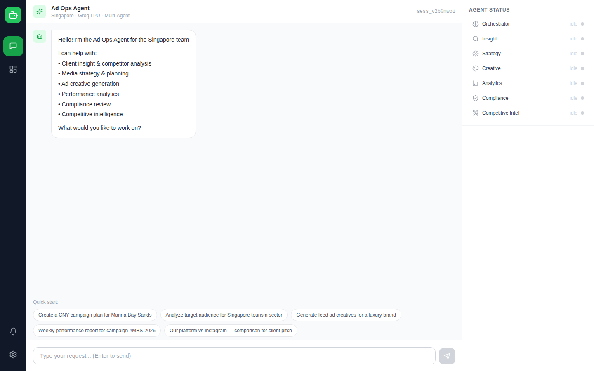

# Ad Ops Multi-Agent System

[](https://github.com/herui03/ad-ops-multi-agent/actions/workflows/tests.yml)

> **Work in progress: review checkpoint.** The backend has been rebuilt around a durable LangGraph approval gate
> (see `backend/`, `tests/`, `docs/evidence/baseline-defects.txt`). The React UI still targets the old API and is being
> rewritten; the rest of this README describes the previous version until the final commit replaces it.
> Offline check: `pip install -r requirements.txt && pytest -q -rs && python scripts/demo_cli.py`.

A multi-agent assistant for a digital advertising sales & operations team, built with LangGraph, FastAPI and React. An account manager types a request in plain English ("plan a CNY campaign for a Marina Bay hotel targeting Chinese tourists"); an orchestrator agent breaks it into sub-tasks, runs six specialist agents in dependency order, streams their status to the UI over WebSocket, raises approval requests for large budgets and blocking compliance issues, and returns one client-ready brief.

> **Project status: portfolio prototype on a simulated use case.**
> This is a personal/course project, not a production system and not a deployment for any real client or employer. The "platform" is a generic, unnamed cross-border social advertising platform; campaign numbers, benchmarks and dashboard figures are hard-coded sample data; client and brand names in prompts and examples are illustrative. The project is not affiliated with, endorsed by, or built on behalf of any advertising platform or company, and it uses no non-public data. Some mock placement labels in the sample data are generic stand-ins for common social-ad formats and should not be read as describing a specific real product.



## The business problem (as simulated)

A Singapore sales team sells social advertising to local brands that want to reach Chinese-speaking visitors and residents. A single client request ("plan a CNY campaign for this hotel") normally touches several people: someone researches the audience, a media planner builds the budget split, a copywriter drafts ads, someone checks the copy against ad policy, and a manager signs off on spend. The prototype explores whether an orchestrated set of LLM agents can produce a first draft of that whole package in one pass, while keeping a human in charge of the two decisions that carry real risk: **how much money to commit** and **whether copy that fails policy review goes out**.

## What I built

All code in this repository was written for this project:

- **Orchestrator** (`backend/agents/orchestrator.py`): a LangGraph state machine with an LLM planning step, a routing branch that answers simple knowledge questions directly, dependency-ordered agent execution, a human-review node and a synthesis step.
- **Six specialist agents** (`backend/agents/`) sharing a common `BaseAgent` that calls Groq in JSON mode, parses the output, times the call and writes the result to shared memory. System prompts and per-agent JSON output contracts live in `backend/prompts/templates.py`.
- **Compliance RAG** (`backend/rag.py`): a hand-written TF-IDF retriever over a small regulation corpus, with no embedding API or vector database.
- **Human approval flow**: approval records created by the graph, stored in shared memory, listed and resolved through REST and WebSocket endpoints, and shown in an approval queue in the UI.
- **Shared memory** (`backend/memory/shared_memory.py`): Redis when `REDIS_URL` is set, otherwise an in-process dict with TTLs.
- **Mock ad platform client and analytics helpers** (`backend/tools/`): sample campaign stats, industry benchmarks, creatives, and a benchmark-deviation anomaly detector.
- **FastAPI backend** (`backend/main.py`) and a **React 18 + Vite + Tailwind UI** (`frontend/src/`): chat, live agent status, approval queue, dashboard and campaign view.
- **Tests and tooling**: offline unit tests, opt-in live LLM tests, a routing demo script, Docker Compose, and a GitHub Actions workflow that runs the unit tests.

## The six specialist agents

| Agent | Responsibility | What it reads before calling the model | Model |
|---|---|---|---|
| **Insight** | Client and audience profiling, competitor landscape, industry benchmarks | Mock industry benchmark from the ad API client (defaults to `tourism_hospitality`) | Llama 3.3 70B |
| **Strategy** | Media plan: placements, budget split, flight schedule, targeting, performance forecast | Insight output from shared memory | Llama 3.3 70B |
| **Creative** | Ad copy per placement (with A/B versions), visual briefs, video scripts | Strategy and Insight outputs | Llama 3.3 70B |
| **Analytics** | Campaign reporting, anomaly detection against benchmarks, optimisation suggestions | Mock campaign stats, report summary and anomaly list, **only when a `campaign_id` is present in context** (see Limitations) | Llama 3.3 70B |
| **Compliance** | Reviews copy against policy and regulations retrieved from the RAG store; cites the source text for each issue | Creative output, plus the top-3 retrieved regulation chunks | Llama 3.1 8B (fast) |
| **Competitive Intelligence (CI)** | Platform-vs-platform comparison, objection handling, pitch talking points | Insight output | Llama 3.3 70B |

The **orchestrator** (Llama 3.3 70B) sits above them. It classifies the request, writes an execution plan (which agents, in which order, with which `depends_on` links) and synthesises the final brief. Model names come from `GROQ_MODEL` / `GROQ_MODEL_FAST` in `.env`.

## Architecture

```
React UI (chat · dashboard · approval queue · live agent status)
        │  REST + WebSocket
   FastAPI backend
        │
   Orchestrator (LangGraph state machine)
   planning ─┬─► direct_answer ─► END                      (empty plan: knowledge question)
             └─► execute_agents (phased) ─┬─► human_review ─► synthesize ─► END
                        │                 └─────────────────► synthesize ─► END
        ┌────────┬──────┴───┬──────────┬────────────┬────────┐
        ▼        ▼          ▼          ▼            ▼        ▼
     Insight  Strategy  Creative  Analytics   Compliance    CI
                                                   │
                                             TF-IDF RAG over
                                             rag_documents/
        │
   Shared memory (Redis, or in-process fallback): sessions, agent outputs, approvals
   Ad platform API client (mock mode: sample campaigns, benchmarks, creatives)
```

Design decisions worth pointing out:

**Routing before planning.** The planning prompt tells the orchestrator to return an empty plan, with the answer in the `intent` field, for general knowledge questions ("what is CPM?"). An empty plan routes to `direct_answer` and ends the graph, so those questions cost one model call instead of planning, several agent calls and a synthesis call.

**Dependency-ordered execution.** `_group_by_phase` turns the plan's `depends_on` links into phases. Agents pass work to each other through shared memory: Strategy reads Insight's output, Creative reads the media plan and audience insight, Compliance reads the creatives, CI reads the insight. Each agent's status (running / completed / failed) is pushed to the UI over the WebSocket as it happens.

**Human-in-the-loop on the decisions that matter.** After execution the graph routes to `human_review` when the planner set `requires_human_approval`, when the Strategy budget (`budget.total_cny`) is above **¥100,000**, or when Compliance returns `overall_pass: false`. The review node creates an approval record for a budget over the threshold and for any compliance issue with severity `block`. It saves the record to shared memory and pushes it to the UI, and the final brief ends with an "Items requiring your approval" list. The account manager approves or rejects in the approval queue, and the decision and feedback are stored. See Limitations for what the decision does *not* do yet. An automation tool for ad spend that never asks is not one a sales team would trust.

**Grounded compliance.** The compliance agent doesn't rely only on the model's memory of advertising rules. It retrieves relevant passages from a regulation corpus and its prompt requires it to cite them (`regulation_source`, `regulations_referenced`). The prompt also carries a short list of hard-coded rules (banned superlatives, finance disclaimers, and similar).

## How the RAG actually works

This is deliberately small and dependency-free:

| Item | Actual implementation |
|---|---|
| Corpus | 3 hand-written `.txt` files in `rag_documents/`: a summary of advertising regulations (FTC, UK ASA CAP Code, health, finance, alcohol, children, GDPR/CCPA, comparative, green claims, influencer), summaries of Meta / Google Ads / TikTok / LinkedIn ad policies, and brand guidelines for a fictional company ("NovaByte Technologies"). These are paraphrased summaries written for the project, not official policy texts. |
| Chunking | LangChain `RecursiveCharacterTextSplitter`, `chunk_size=500`, `chunk_overlap=50`, giving **36 chunks** (printed at startup: `[RAG] Split into 36 chunks`) |
| Indexing | Term frequency per chunk plus smoothed IDF (`log((n+1)/(df+1)) + 1`), computed in pure Python at FastAPI startup |
| Query | The Creative agent's `creatives` field (or the task text if there are no creatives yet) |
| Scoring / top-k | Sum of `tf_query · idf · tf_chunk · idf` over shared terms; top **3** chunks with score > 0 |
| Use | The chunks are injected into the Compliance agent's context as `retrieved_regulations_from_rag` |

There are no embeddings, no vector database and no external API, so retrieval is fully reproducible. The trade-off is that retrieval is purely lexical: it matches shared words, not meaning. The retrieved chunks are not always the most relevant ones, especially when the creatives are in Chinese and the corpus is in English.

## Running it

You need a free Groq API key from [console.groq.com](https://console.groq.com). The backend builds its Groq clients at import time, so it will not start with `GROQ_API_KEY` empty (any non-empty value lets it boot, but chat requests then fail). The offline unit tests only need a placeholder value; CI uses `GROQ_API_KEY=test-key`.

```bash
# backend
python -m venv venv && source venv/bin/activate
pip install -r requirements.txt
cp .env.example .env            # add GROQ_API_KEY
uvicorn backend.main:app --reload --port 8000

# frontend (second terminal)
cd frontend && npm install && npm run dev
```

Open http://localhost:5173. API docs are at http://localhost:8000/docs. `./start.sh` does both steps, and `docker compose up` runs backend, frontend and Redis together.

## Demo walkthrough

With a Groq key set, these are the examples the project is built around. Steps 2, 4 and 5 use the UI's quick-start buttons.

1. **Knowledge question → direct answer.** Ask "What is CPM?". The trace shows a single `direct_answer` step and no specialist agents run. `python scripts/demo_routing.py` runs this check for three knowledge questions and two agent tasks and prints PASS/FAIL per question.
2. **Full campaign → multi-agent plan.** Click "Create a CNY campaign plan for a Marina Bay hotel". Watch the Agent Status panel as the planned agents move from running to completed in dependency order, then read the synthesised brief.
3. **Approval queue.** If the Strategy agent proposes a budget above ¥100,000, or Compliance flags a blocking issue, an approval card appears. Approve or reject it with feedback, and the decision is recorded via `POST /api/approvals/{id}/decide`.
4. **Compliance with citations.** Click "Generate feed ad creatives for a luxury brand". When the planner includes Compliance, its agent's output lists issues with a `regulation_source` taken from the retrieved chunks.
5. **Competitive pitch.** Click "Our platform vs Instagram — comparison for client pitch". The planner is expected to route this to the CI agent, which returns objection handling and talking points.

LLM output varies between runs, so which agents the planner picks and whether an approval is triggered are not guaranteed for a given prompt.

## Tests and what has been verified

```bash
GROQ_API_KEY=test-key pytest     # 7 offline unit tests; placeholder key only (tests/live is excluded in pytest.ini)
pytest tests/live -q             # 8 live tests against Groq; needs GROQ_API_KEY
python scripts/demo_routing.py   # prints how the orchestrator routes sample requests; needs GROQ_API_KEY
cd frontend && npm ci && npm run build   # production build of the UI
```

The **unit tests** (run in CI on every push to `main` and on pull requests) cover: agent configuration (Insight prompt, Compliance on the fast model), orchestrator initialisation with exactly the six agents, dependency-phase grouping (5 steps → 4 phases), the in-memory session and agent-output store, and the benchmark anomaly detector.

The **live tests** check routing behaviour against the real model: three knowledge questions must be direct answers, two work requests must call agents, and edge cases (empty input, a Chinese-language question, response shape) must not crash. They depend on the model and on network access, so they are opt-in and not run in CI.

The unit tests do **not** exercise model output quality, RAG retrieval quality, the WebSocket flow or the React UI behaviour.

## Limitations

- **Mock data only.** The ad platform client runs in mock mode, and its real-API methods raise `NotImplementedError`. Wiring a real ads API means replacing `backend/tools/ad_api.py` and adding auth. The `/api/dashboard/stats` endpoint returns hard-coded numbers, and the dashboard's spend-by-placement pie is hard-coded in the React component. None of these figures are measurements.
- **Approvals don't resume the graph.** The review node records approvals and the brief lists them, but the graph runs through to synthesis without waiting. A later approve/reject decision is stored, but it is not fed back into the plan or used to regenerate anything. A true pause-and-resume would use LangGraph interrupts with a checkpointer.
- **Some context is never populated by the chat flow.** The orchestrator passes only `session_id` to agents. Analytics fetches mock campaign stats and runs anomaly detection only when a `campaign_id` is in context, and client-profile lookups need a `client_name`, so neither path runs from the chat UI today. Insight always uses the default `tourism_hospitality` benchmark.
- **Output validation.** Agent outputs are parsed as JSON (with a fallback to raw text) but not validated against per-agent schemas. Pydantic models for each output would make synthesis more robust.
- **Sequential execution.** Steps within a phase still run one after another. Independent agents (e.g. Insight and CI) could run concurrently with `asyncio.gather`.
- **Small, hand-written corpus.** The RAG corpus is 36 chunks of paraphrased summaries. A real deployment would ingest actual policy documents and move to embedding-based or hybrid retrieval once the corpus outgrows TF-IDF.
- **No evaluation harness.** Nothing measures output quality yet. The next step would be a small set of golden requests with rubric-based scoring.
- **Prototype security posture.** There is no authentication, and CORS is configured for local development.

## Stack

Python 3.12 (CI) · FastAPI · LangGraph + LangChain · Groq (Llama 3.3 70B / 3.1 8B) · Redis (optional) · React 18 + Vite + Tailwind · pytest · GitHub Actions

## Project layout

```
backend/
  agents/        orchestrator.py (LangGraph graph), base_agent.py, one file per specialist agent
  prompts/       system prompts and JSON output contracts for each agent
  tools/         ad platform API client (mock mode) and analytics helpers
  memory/        shared memory with Redis / in-process fallback
  models/        Pydantic request/response schemas
  rag.py         TF-IDF retriever over rag_documents/
  main.py        FastAPI app: chat, approvals, sessions, dashboard, WebSocket
frontend/src/    React UI: ChatPanel, AgentStatus, HumanApproval, Dashboard, CampaignView
rag_documents/   regulation corpus used by the compliance agent
scripts/         demo_routing.py
tests/           unit tests; tests/live/ for LLM-backed tests
```

## Background

Built for the BC3415 course project at NTU.

---

**Herui Dou** · MSc Business Analytics, NTU · [LinkedIn](https://www.linkedin.com/in/heruidou)
