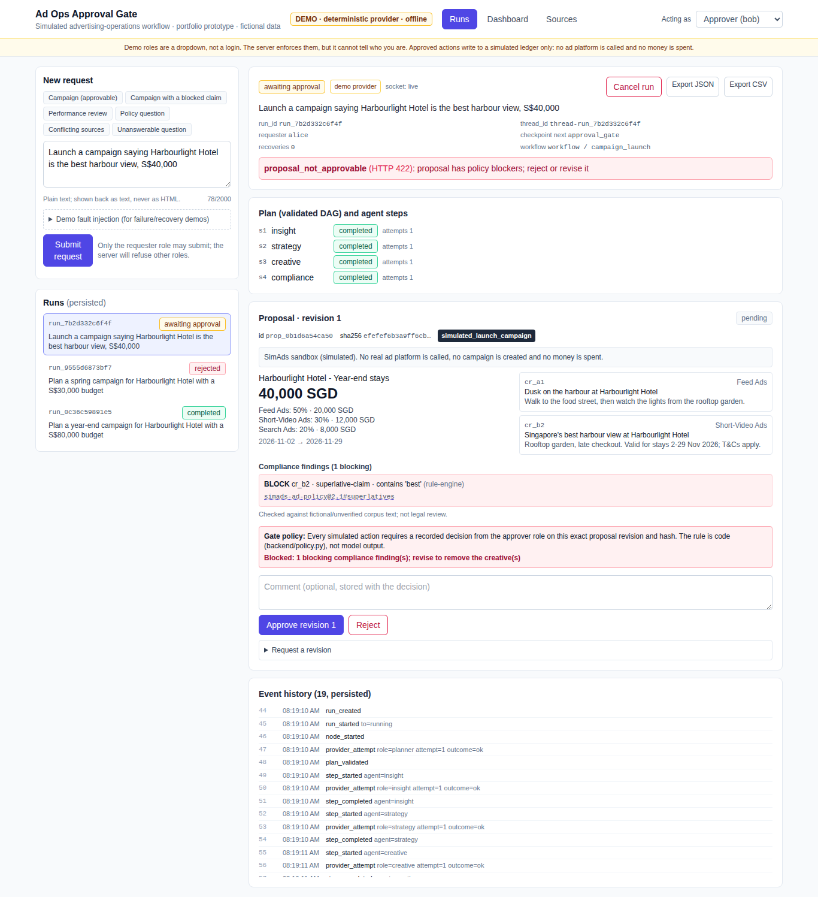

# Ad Ops Approval Gate

[](https://github.com/herui03/ad-ops-multi-agent/actions/workflows/tests.yml)

Advertising-operations teams turn a client brief into a media plan, ad copy and a policy check, and a manager signs off before budget is committed. This project automates the drafting with a LangGraph multi-agent workflow and makes the sign-off enforceable. The workflow pauses at a durable approval gate, and a (simulated) action runs only after an approver accepts the exact proposal revision they reviewed. Restarts, double clicks, stale revisions, provider failures and crashes near the action cannot bypass the gate or repeat the action.

It runs offline by default with a deterministic demo provider. The ad platform, clients and actions are simulated; see [Scope and limits](#scope-and-limits).


## What it does

- **Plans and validates the work.** A planner splits the request into steps for six specialist agents. The plan must form a valid dependency graph, and each agent's output must match a strict schema.
- **Pauses for approval.** The result is a proposal with an id, a revision number and a sha256 fingerprint. The run waits in a LangGraph checkpoint (`interrupt()` + SQLite) and survives server restarts.
- **Enforces decisions on the server.**
  - Approve, reject and revise require the approver role; the requester cannot approve their own run.
  - Stale revisions, mismatched hashes and IDs from other runs are refused.
  - A double click or retried request executes at most once (idempotency keys).
- **Blocks non-compliant copy.** A rule engine and a compliance agent flag claims such as "best", each citing the policy passage it relies on. A blocked proposal must be revised before it can be approved.
- **Handles failures explicitly.**
  - Provider calls have timeouts and a bounded number of attempts; a failed step leaves the run `failed` with an error code.
  - *Recover* resumes from the last checkpoint without re-running finished steps or repeating a committed action.
  - Cancel is refused once an action is committed.
- **Looks up policy text.** It returns verbatim excerpts with citations that resolve to a document, version, section and hash. It abstains when support is weak, reports when sources conflict, and ignores sources that contain injected instructions. Results are labelled as unverified keyword matches for human review.
- **Web UI.** Live run status and event history, decision history, JSON/CSV export, a dashboard computed from stored runs, and a mobile layout.

## Example

1. A requester submits *"Plan a year-end campaign for Harbourlight Hotel with a S$80,000 budget."*
2. Four agents (insight → strategy → creative → compliance) draft the plan, checkpointing after each step.
3. The proposal appears as revision 1, awaiting approval. The simulated ledger still has 0 actions.
4. The approver approves revision 1, and exactly one simulated launch is written to the ledger. A double click changes nothing.
5. If the server is killed while the run waits, the same run is still waiting after restart. If it crashes right after the action is written, *Recover* detects the existing record instead of writing a second one.

| One simulated action after approval | Blocked copy must be revised | Crash recovered without a duplicate |
|---|---|---|
|  |  |  |

The walkthrough is in [docs/DEMO_SCRIPT.md](docs/DEMO_SCRIPT.md) (3 minutes). All screenshots are in [docs/screenshots/](docs/screenshots/). A recorded replay of the browser test run is at [docs/replay/index.html](docs/replay/index.html); it is a static page, so open it locally from a clone.

## Quick start

Requires Python 3.11+ (3.12 recommended) and Node.js 20+.

```bash
./scripts/start.sh            # creates .venv, installs dependencies, builds the UI once, serves http://127.0.0.1:8000
```

No API key or network is needed after installation. Manual and Mac steps, the optional live Groq provider, recovery procedures and data reset are in [docs/RUNBOOK.md](docs/RUNBOOK.md).

```bash
python scripts/demo_cli.py    # the same flow in the terminal
pytest -q -rs                 # backend tests (offline)
```

## How it works

```
React UI ── REST + read-only WebSocket ──► FastAPI ──► WorkflowRunner
                                                        ├─ LangGraph graph + SqliteSaver (thread_id per run)
                                                        ├─ SQLite store: runs, events, steps, proposals,
                                                        │   decisions, idempotency keys, simulated ledger
                                                        ├─ provider: demo (default) | Groq (opt-in)
                                                        └─ policy · grounding · simulator
plan ─► step ⟲ ─► build_proposal ─► approval_gate (interrupt) ─► execute_action ─► finalize
                         ▲                   ├─ reject ─► rejected
                         └──── revise ───────┤─ cancel ─► cancelled
```

| Guarantee | Mechanism | Tests |
|---|---|---|
| No action before approval | `interrupt()` at the gate; the simulator re-checks for an approve decision on the exact id, revision and hash in the same transaction as the ledger insert | `test_ac1_*`, `test_simulator_refuses_without_recorded_approval` |
| A pending run survives a restart | SQLite checkpointer with a stable `thread_id`; startup reconciliation | `test_ac2_*`; E2E kills the real server |
| One decision wins; duplicates replay | One `BEGIN IMMEDIATE` transaction for checks and the status change; idempotency keys with a request hash | `test_ac4_*` (8 concurrent threads) |
| Stale, forged or cross-run decisions fail | Current-revision, sha256 and run-ownership checks | `test_ac5_*`, `test_ac6_*` |
| Accepted cancels win; committed actions are never hidden | Cancel-aware terminal writes; every cancel path refuses with 409 once an action is committed; atomic recovery claim | `test_r5_01_*`, `test_r5_02_*` |
| A crash near the action does not duplicate it | Ledger row keyed `run:proposal:revision`; replay detection on Recover | `test_ac10_*`; E2E process exit after commit |
| Failures are bounded and reported | Per-call timeout, 2 attempts, strict schemas, `failed` status with a code; dependent steps never run | `test_ac8_*`, `test_invalid_plan_dag_*` |
| Model or source text cannot open the gate | The gate is code policy by workflow type; injected sources are excluded; citations must resolve | `test_ac12_*` |

State diagrams, the transaction boundary and design rationale: [docs/ARCHITECTURE.md](docs/ARCHITECTURE.md).

### Specialist agents

Each agent has a system prompt (live mode), a strict Pydantic output contract, and a defined set of upstream outputs it may read. Demo mode uses deterministic generators with the same output shapes.

| Agent | Produces | Checks beyond the schema |
|---|---|---|
| insight | client/audience profile, mock benchmarks | — |
| strategy | budget, schedule, placement split | percentages sum to 100; end date not before start |
| creative | ad copy per placement | unique creative ids |
| compliance | findings with severity and citation | citations must resolve to a retrieved, non-flagged corpus chunk; a deterministic rule engine also runs |
| analytics | anomalies against mock benchmarks, recommended budget shift | — |
| ci | illustrative channel comparison, talking points | — |

The workflows *campaign_launch* (simulated launch) and *performance_review* (simulated budget shift) go through the approval gate. *pitch_support* produces a document only and needs no approval.

### Policy lookup

The corpus has 7 documents split into 37 section chunks, each with a stable id and a sha256. Retrieval is TF-IDF keyword matching. Output is extractive:
- verbatim sentences with resolvable citations, labelled `unverified_excerpts`;
- otherwise `abstained`, with any closest candidate evidence listed separately;
- or `conflict`, when sources tagged with the same topic disagree anywhere in the corpus.

Questions about who approved or authored a document abstain, because no source records that metadata. Method and results: [docs/EVALUATION.md](docs/EVALUATION.md).

## Validation

| Check | Command | Result |
|---|---|---|
| Backend tests | `pytest -q -rs` | 114 passed, 1 skipped (the live-provider test needs `GROQ_API_KEY`) |
| Browser end-to-end | `node e2e/run_e2e.mjs` | 16/16 checks against a real server process (approval, role denial, rejection, revision, kill while pending, crash after commit then recovery, provider failure then recovery, policy lookup, unsafe text, dashboard, 390 px mobile) |
| Policy lookup | `python scripts/run_eval.py [--cases …]` | held-out: 19/23 (round 1), 21/24 (round 5); the same case sets as regression after later fixes: 22/23, 22/24 |
| Original prototype defects | `scripts/repro_baseline_defects.py` | 13/13 reproduced on the original code, each mapped to a fixing test |

Per-case results, screenshots and logs: [docs/ACCEPTANCE.md](docs/ACCEPTANCE.md). Defects found in review and their fixes: [docs/DEFECT_LOG.md](docs/DEFECT_LOG.md).

## Scope and limits

- **Data.** The ad platform ("SimAds sandbox") and the clients Harbourlight Hotel and NovaByte are fictional; campaign figures and benchmarks are mock data. The policy corpus mixes fictional policies with unverified paraphrases of public frameworks (e.g. FTC, UK CAP Code) and public platform policies. Nothing is affiliated with any real platform or company, and a citation is not legal advice.
- **Actions.** "Execute" writes a row to a local simulated ledger. There is no ad-platform integration and no spend, and exactly-once delivery to an external system is not claimed.
- **Access.** Demo roles are self-declared request headers, enforced server-side but not authentication. Run locally only.
- **Deployment.** Single process. The data-directory lock uses POSIX `flock` (tested on Linux, untested on macOS, Windows unsupported).
- **Language models.** The default provider is deterministic rules. The optional Groq provider is covered by offline wiring tests only and has not been run against the live API.
- **Policy lookup.** Matching is lexical: it can miss paraphrases, and a relevant excerpt can still answer a different question.
- **Validation.** All results are developer-run tests in a Linux container. No user acceptance testing with real users has been done.

## Documentation

| Doc | Contents |
|---|---|
| [HR_OVERVIEW.md](docs/HR_OVERVIEW.md) | one-page summary |
| [DEMO_SCRIPT.md](docs/DEMO_SCRIPT.md) | 3-minute demo |
| [ARCHITECTURE.md](docs/ARCHITECTURE.md) | components, state and graph diagrams, decision path, transaction boundary, rationale |
| [RUNBOOK.md](docs/RUNBOOK.md) | setup (incl. Mac), checks, live provider, operating the gate, failure recovery, reset |
| [ACCEPTANCE.md](docs/ACCEPTANCE.md) | 16 acceptance cases mapped to tests and evidence |
| [EVALUATION.md](docs/EVALUATION.md) | policy-lookup method, results, failure analysis |
| [DEFECT_LOG.md](docs/DEFECT_LOG.md) | reproduced defects and their fixes |

## Project layout

```
backend/
  agents/orchestrator.py   LangGraph graph + WorkflowRunner (drive, decide, cancel, recover, reconcile)
  agents/*_agent.py        six agent specs;  prompts/templates.py  live-mode prompts
  contracts.py             plan DAG + per-agent output contracts, API bodies
  store.py                 SQLite store (transactions, idempotency, decisions, ledger)
  policy.py                gate policy, rule-engine compliance, proposal assembly
  grounding.py             corpus, TF-IDF retrieval, extractive answers, citations
  simulator.py             simulated action executor (transaction boundary)
  providers.py             demo / Groq providers, fault injection, bounded call policy
  datalock.py              data-directory lifetime lock
  demo_generators.py       deterministic demo outputs;  tools/  mock data + analytics helpers
  main.py                  FastAPI routes, read-only WebSocket, exports
frontend/src/              React UI (runs, proposals and decisions, recovery, lookups, dashboard, sources)
rag_documents/             labelled policy corpus;  eval/  evaluation cases (read only by scripts/run_eval.py)
tests/                     offline suite;  tests/live/  opt-in live test
e2e/                       Chromium end-to-end driver + recorded-replay builder
scripts/                   start.sh, demo_cli.py, run_eval.py, reset_demo_data.py, repro_baseline_defects.py
docs/                      docs above + evidence/, screenshots/, replay/
```

## Background

Originally built for the BC3415 course project at NTU, then rebuilt around the approval gate.

---

**Herui Dou** · MSc Business Analytics, NTU · [LinkedIn](https://www.linkedin.com/in/heruidou)
