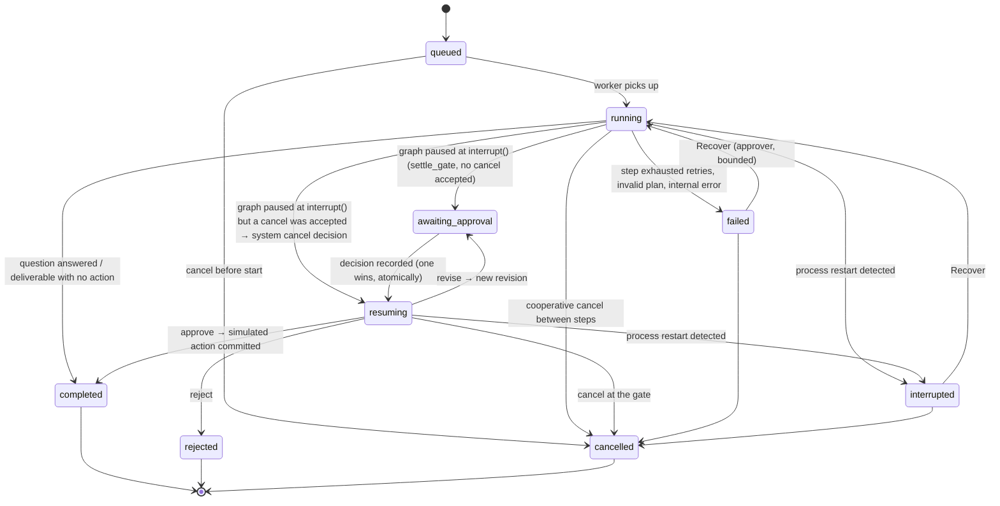
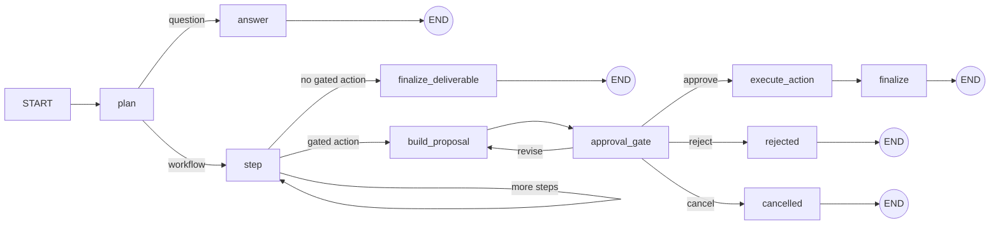

# Architecture and state flow

This is a simulated advertising-operations workflow built to show **reliable execution around a human approval gate**. It is a portfolio prototype: no real client, employer, ad platform or spend is involved.

## Components

```
Browser (React + Vite + Tailwind)          one origin: FastAPI also serves frontend/dist
  │  REST: create run, decide, cancel, recover, exports, sources, dashboard
  │  WS  : /ws/runs/{run_id}  (read-only stream of persisted events)
FastAPI  backend/main.py
  │
WorkflowRunner  backend/agents/orchestrator.py
  ├─ LangGraph StateGraph, compiled with SqliteSaver ──► data/checkpoints.db
  │     thread_id = runs.thread_id (one per run), durability="sync"
  ├─ Store (SQLite, WAL, BEGIN IMMEDIATE)          ──► data/adops.db
  │     runs · run_events · run_steps · proposals · decisions · idempotency · sim_actions
  ├─ Provider: DemoProvider (default, deterministic, offline) | GroqProvider (opt-in)
  │     └─ invoke_structured: timeout, bounded attempts, JSON parse, schema + semantic checks
  ├─ Six specialist agents (backend/agents/*_agent.py): insight, strategy, creative,
  │     compliance, analytics, ci — each is a spec: prompt + strict output contract
  ├─ Policy (backend/policy.py): which workflows are gated, rule-engine compliance, proposal assembly
  ├─ Grounding (backend/grounding.py): TF-IDF retrieval + extractive answers with verifiable citations
  └─ Simulator (backend/simulator.py): "SimAds sandbox" ledger; the only place an action "happens"
```

## Run state machine (application store)



`awaiting_approval` is a real pause. The LangGraph checkpoint holds a pending `interrupt()` and no thread or timer waits on it. A restart does not change it: `reconcile_on_startup` checks the checkpoint still holds the interrupt and leaves the run alone.

## Graph (LangGraph)



* **plan**: the provider's plan must parse into `contracts.Plan`. That means at most 8 steps, known agents, unique ids, every dependency existing, acyclic (Kahn's algorithm), required agents present for the workflow type, and ordering such as compliance after creative. Anything else raises `schema_violation` after bounded attempts. Nothing runs speculatively, and there is no fallback task.
* **step**: runs one validated step per super-step, so each completed step is checkpointed. The step sees only its ancestors' outputs. A failure raises; LangGraph does not checkpoint the failed node, and Recover repeats only that step.
* **build_proposal**: assembles the proposal from agent outputs, the deterministic rule engine and any revision changes. It upserts `(run_id, revision)` idempotently and computes sha256 over the canonical JSON, which includes `run_id` and `revision`.
* **approval_gate**: `decision = interrupt({...proposal ref...})`. There is **no code before `interrupt()`**, because LangGraph re-runs the whole node on resume (confirmed in the docs and in a prototype, where pre-interrupt code ran twice). After resume it re-checks that the decision targets the same proposal id, revision and hash.
* **execute_action**: calls the simulator (next section).

State holds only JSON. The runner, store, provider and sockets live outside it and are reached through closures, so nothing non-serializable is checkpointed.

## Decision path (the only way through the gate)

`POST /api/runs/{run_id}/decisions` → `Store.record_decision`. This is one `BEGIN IMMEDIATE` transaction:

1. **Idempotency key.** Same key and same payload returns the stored response (`replayed: true`). Same key with a different payload is `409 idempotency_key_reused`.
2. **Role.** Approve, reject and revise need `approver`. The requester cannot decide their own run (separation of duties).
3. **Run status.** It must be `awaiting_approval`; otherwise `409 run_not_awaiting_approval`. This is what makes concurrent clicks safe.
4. **Proposal.** The proposal must exist (else `404`) and belong to this run (else `409 proposal_run_mismatch`). It must be the current pending revision (else `409 stale_revision`) and the hash must match (else `409 proposal_hash_mismatch`).
5. **Approve.** Needs `policy.approvable`, which means no blocking compliance finding and not above the hard cap (else `422`).
6. **Write.** Insert the decision, mark the proposal, move the run to `resuming`, append the event and store the idempotency record.

After commit, the runner resumes the graph with `Command(resume=decision)` under a per-run lock. The WebSocket is read-only. The old `/api/approvals/{id}/decide` and `/api/chat` endpoints return `410`. There is no second path.

## Transaction boundary of the simulated action

`Simulator.execute` runs one SQLite write transaction. In it, it checks that an `approve` decision exists for the exact proposal id, revision and sha256 and that the proposal is `approved`, then inserts one `sim_actions` row keyed `run_id:proposal_id:revision` (UNIQUE).

| Crash point | What survives | Recover does |
|---|---|---|
| Decision committed, graph not resumed | decision row, run `resuming` | Restart marks the run `interrupted`. Recover sees the checkpoint still paused at the gate and re-applies the recorded decision once. |
| Inside the transaction, before commit | nothing (rollback) | re-runs `execute_action` and commits once |
| After commit, before the node is checkpointed | ledger row | re-runs `execute_action`, finds the row, emits `simulated_action_replay_detected`, commits nothing new |

**Not claimed:** exactly-once execution against an external system. A real ad API adds a window this local transaction cannot close: the remote call succeeds but the local commit is lost. Closing it needs the remote side to honour an idempotency key, or a reconciliation read against the platform before retrying. The ledger key is the value that would be sent as that idempotency key.

## Cancellation semantics (review round 5)

A cancel is either **accepted before the run reaches a terminal state or the gate**, in which case it wins, or it is **refused with a reason**. It is never accepted and then ignored.

| When the cancel arrives | What happens |
|---|---|
| queued / running (any step, including the planner or the last step) | `cancel_requested` is set. Nodes check it at their start. Terminal writes go through `Store.finish`, which ends the run `cancelled` instead of `completed` or `failed` if the flag was set first. Both take the SQLite write lock, so there is no gap between check and write. |
| after `build_proposal`'s check, before `interrupt()` | When the graph pauses, `Store.settle_gate` sees the accepted cancel, records a `system` cancel decision on the pending revision and resumes into the `cancelled` branch. The run never shows as `awaiting_approval`, and a later approve gets 409. |
| awaiting approval | Recorded as a `cancel` decision on the current revision; the graph resumes into `cancelled`. |
| resuming (a decision is being applied) | `409 run_busy`: the outcome of the in-flight decision decides. |
| failed / interrupted, **no action committed** | `cancelled`. Any recorded but unexecuted approve is voided and the proposal is marked `cancelled`. Recover then refuses. |
| failed / interrupted, **a simulated action already committed** (crash after commit) | `409 action_already_committed` with the action ids. The run cannot be marked cancelled as if nothing happened; Recover reconciles it to `completed`. |

At the action boundary the simulator also refuses inside its ledger transaction if the run is not `resuming` or `running`, or if a cancel was accepted.

## Recovery claim (review round 5)

`Store.claim_recovery` checks eligibility and increments `recover_count` in **one** write transaction: the status must be `failed` (retryable) or `interrupted`, and the count must be under the limit. Two concurrent Recover calls cannot both win; the second gets 409.

`Store.transition` is strict: current == target is accepted only when a graph node passes `idempotent=True` for its own replayable terminal write. If a recovered graph is already at END but the store is not terminal, `_reconcile_finished` derives the status from the checkpoint and the ledger, or fails explicitly with `inconsistent_state`. It never leaves the run `running`.

## Why these choices

| Choice | Reason |
|---|---|
| LangGraph `interrupt()` + `SqliteSaver` | A durable pause that survives restarts, keyed by a stable `thread_id`. This is the primitive the docs prescribe for human-in-the-loop. |
| A separate application store | The gate rules (roles, revisions, idempotency, ledger) need transactional reads and writes. The checkpointer is an execution log, not a place to enforce business rules. |
| Deterministic demo provider | Anyone can run the whole flow with no key and no network, and tests are reproducible. It is labelled everywhere so it is not mistaken for a model. |
| Rule-engine compliance as a backstop | Model findings are merged, but blocking rules do not depend on a model noticing them. |
| Extractive answers only | Every sentence shown is a verbatim quote with a resolvable citation, so it cannot invent plausible citations. The quoted sentences must themselves support the question, and topic conflicts are checked corpus-wide. The trade-off is lexical matching: it can still quote an on-topic sentence that does not answer the question (see EVALUATION.md). |
| Redis removed | One transactional store is simpler and stronger than a cache plus a database for this workload. |

## Limits

* Single process. Per-run locks are in-process, and SQLite serializes writes. Running several workers would need a database-level lease per run.
* Demo roles are self-declared headers. They are enforced server-side, but they are **not authentication**. GET endpoints are open. Do not expose the server publicly.
* The body-size check uses `Content-Length`; request fields also have length limits after parsing.
* A timed-out provider call cannot be killed in Python. It is abandoned, and the live provider's own HTTP timeout ends it.
