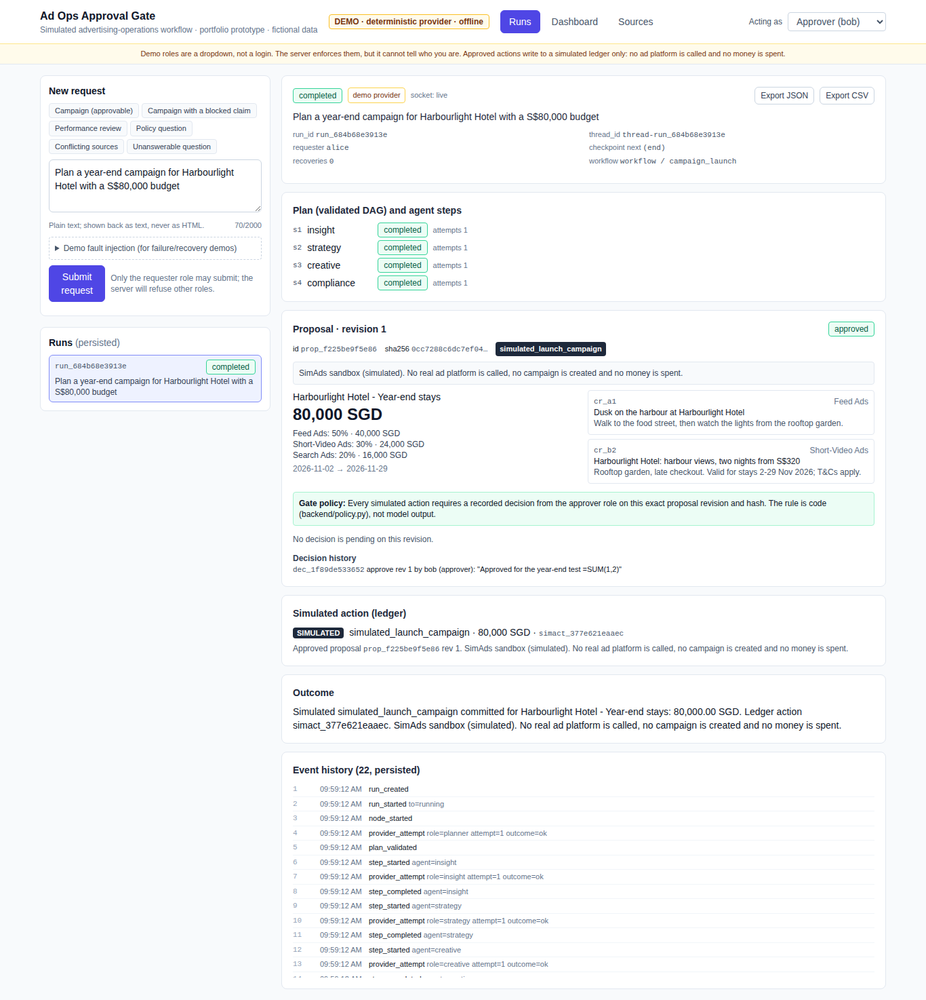
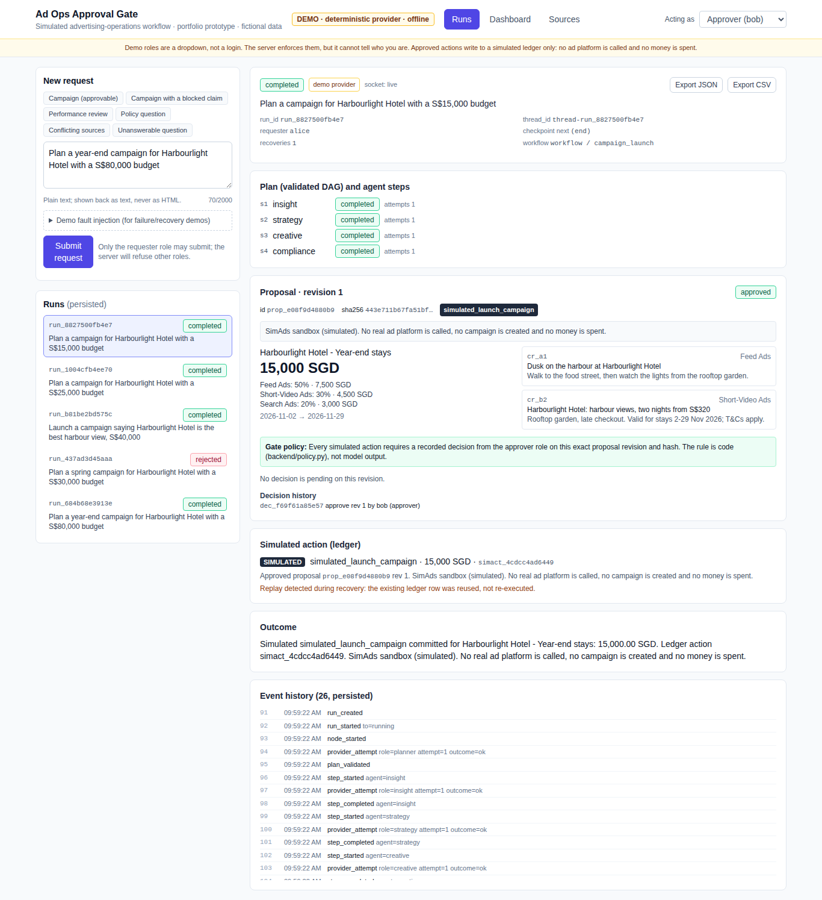

# Ad Ops Approval Gate: 60-second overview

**What it is:** a portfolio prototype showing how to put AI agents to work on an advertising-operations task *safely*. The AI drafts; a person must approve before anything happens; and the system stays correct when things go wrong (restarts, double clicks, crashes, bad AI output).
**What it is not:** a real client project, an employer deployment, or anything connected to a real ad platform or real money. The platform ("SimAds sandbox"), clients and policies are fictional.

## The business problem
A sales team turns a client request into a media plan, ad copy and a policy check, and then a manager signs off before budget is committed. AI can draft all of that quickly. The risk is an AI system that **acts without a real sign-off**, or acts twice.

## One concrete flow
1. A requester types: *"Plan a year-end campaign for Harbourlight Hotel with a S$80,000 budget."*
2. Four specialist agents (insight → strategy → creative → compliance) draft the plan, one saved step at a time.
3. The result is a **proposal** with an id, a revision number and a fingerprint (sha256). The run **pauses**; nothing has executed.
4. An approver (a different person) approves *that exact revision*. Only then is one **simulated** action written to a ledger.
5. If the server restarts while waiting, the same run is still waiting afterwards. If someone double-clicks, still exactly one action. If the server crashes right after the action, recovery notices and does not repeat it.

| After approval: one simulated action | After a crash: recovered, no duplicate |
|---|---|
|  |  |

## Technology
Python · FastAPI · **LangGraph** (durable pause/resume with a SQLite checkpointer) · SQLite (transactions, idempotency) · React + Vite + Tailwind · pytest · Playwright/Chromium · GitHub Actions. The demo runs **offline with no API key**; a live LLM (Groq) is optional and has **not** been tested.

## 3-minute demo
Run `./scripts/start.sh` and open http://127.0.0.1:8000, then follow [DEMO_SCRIPT.md](DEMO_SCRIPT.md):
submit → see the pause → wrong role refused → restart → approve → blocked ad copy revised → conflicting sources reported → injected failure recovered.

## Evidence
- **114 automated tests** pass (1 live-LLM test skipped: no key).
- **16/16 browser checks**, three runs in a row. They drive the real server, including killing and restarting it.
- **Defects found by an independent reviewer were reproduced first, then fixed**: 13 in the original prototype, plus several review rounds on this rebuild. See [DEFECT_LOG.md](DEFECT_LOG.md).
- Document lookup: the last held-out result is **21/24**. It is reported as **unverified keyword excerpts that need human review**, not verified answers. See [EVALUATION.md](EVALUATION.md).
- Full matrix: [ACCEPTANCE.md](ACCEPTANCE.md).

## Limitations (stated up front)
- Simulated only: no real ad platform, no spend, and no exactly-once guarantee claimed for external systems.
- Demo roles are a dropdown, **not a login**. Local use only.
- Single server process. The reset tool is tested on Linux; macOS is untested.
- Document lookup is keyword-based and can quote a relevant sentence that answers a different question.
- All tests are developer tests, not user acceptance by a real stakeholder.

## Who did what (AI attribution)
**Herui Dou** set the project direction, its intended use as a job-search portfolio piece, and the priorities (reliability over agent count, honest limits). Herui did not personally write the detailed requirements or acceptance criteria listed in these docs. **Codex** (an AI review tool) turned that scope into review requirements and acceptance cases, and independently reviewed the source. **Claude** (an AI coding assistant) wrote the code, tests and documentation in this rebuild. Herui's own hands-on role is limited to what Herui can explain and personally reproduce; see [CV_TEMPLATES.md](CV_TEMPLATES.md). Earlier history in this repository was not independently attributed.

Security and privacy check: all reachable git history was scanned for credentials and personal files. None were found. Summary: [evidence/history-audit.txt](evidence/history-audit.txt).
